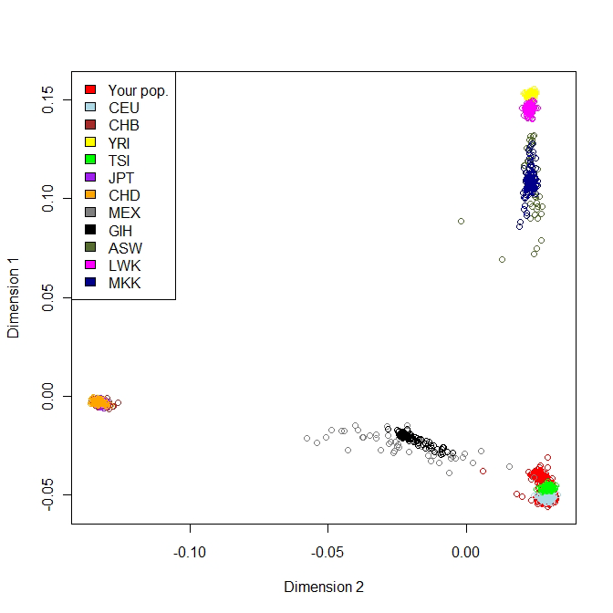
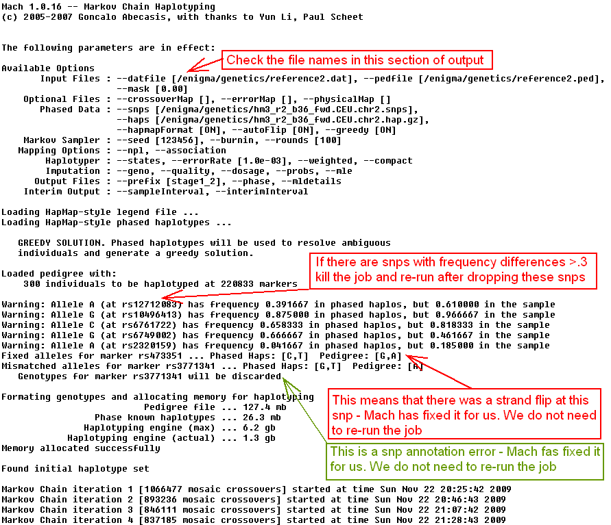

# Enigma Protocols for Imputation at each site – v1.2

*Last update September 20, 2010*

**Written by [Sarah Medland](mailto:medlandse@gmail.com), 
[Derrek Hibar](mailto:dhibar@gmail.com), 
[Alejandro Arias Vasquez](mailto:A.AriasVasquez@psy.umcn.nl), 
and [Jason Stein](mailto:JasonLouisStein@gmail.com)**

---

**Before we start, you need to download and install some required programs 
(which you may already have). The required programs are: Plink, R, Mach, ssh 
client, mach2qtl. Links to the download sites are available below. Please 
address any questions to: enigma@lists.loni.ucla.edu.**
*   Plink can be downloaded 
    [here](http://pngu.mgh.harvard.edu/~purcell/plink/download.shtml).
*   R can be downloaded [here](http://cran.stat.ucla.edu/).
*   Mach can be downloaded 
    [here](http://www.sph.umich.edu/csg/abecasis/MACH/download/).
*   An ssh client can be downloaded 
    [here](http://www.chiark.greenend.org.uk/~sgtatham/putty/download.html) 
    (though there are many to choose from).
*   Download mach2qtl 
    [here](http://www.sph.umich.edu/csg/abecasis/MACH/download/) (run tar -zxvf 
    mach2qtl.tar.gz to decompress the files and then type “make all” in the same
    directory to build. You will then have an executable called mach2qtl that 
    you should add to your path).
    
---

**Population substructure checking – paste the code below into a terminal window
or shell script**

Download the [HapMap3 data](Genetics/GWASBackend/HM3) to your working directory 
which we will call /enigma/genetics/

---

**Filter SNPs out from your dataset which do not meet Quality Control criteria 
(Minor Allele Frequency < 0.01; Genotype Call Rate < 95%; Hardy-Weinberg 
Equilibrium < 1x10<sup>-6</sup>). Directions assume your data are in binary 
plink format (bed/bim/fam), if this is not the case try to convert to plink 
format and contact enigma@lists.loni.ucla.edu with questions.**

```bash
export datafileraw=yourrawdata # replace yourrawdata with the name of the local 
                               #plink file name
plink --bfile $datafileraw --hwe 1e-6 --geno 0.05 --maf 0.01 --make-bed \
    --out ${datafileraw}_filtered
```

---

**Unzip the HM3 genotypes. Prepare the HM3 and the raw genotype data by 
extracting only snps that are in common between the two genotype data sets - 
this avoids exhausting the system memory. We are also removing the strand 
ambiguous snps from the genotyped data set to avoid strand mismatch among these 
snps. Your genotype files should be filtered to remove markers which do not 
satisfy the quality control criteria above.**

```bash
bash # these commands assume you are running bash shell – if you are already 
     #running bash then you don’t need to type this (but it won’t hurt)
cd /enigma/genetics #change directory to a folder with you plink dataset and 
                    #downloaded HM3 files
gunzip *.gz
export datafile=datafile_filtered # replace datafile_filtered with the name of 
                                  #the local plink file name that has been 
                                  #filtered of SNPs not meeting QC criteria (see
                                  #above)
awk '{print $2}' HM3.bim > HM3.snplist.txt
plink --bfile $datafile --extract HM3.snplist.txt --make-bed --out local
awk '{ if (($5=="T" && $6=="A")||($5=="A" && $6=="T")||($5=="C" && $6=="G")||\
    ($5=="G" && $6=="C")) print $2, "ambig" ; else print $2 ;}' $datafile.bim \
    | grep -v ambig > local.snplist.txt
plink --bfile HM3 --extract local.snplist.txt --make-bed --out external
```

---

Merge the two sets of plink files – In merging the two files plink will check 
for strand differences. If any strand differences are found plink will crash 
with the following error (ERROR: Stopping due to mis-matching SNPs -- check +/- 
strand?)

Ignore warnings regarding different physical positions

```bash
plink --bfile local --bmerge external.bed external.bim external.fam --make-bed \
    --out MDSfile # this step will take a while (less than 1 hour)
```

---

If plink crashed with a strand error (ERROR: Stopping due to mis-matching SNPs 
-- check +/- strand?) run the following two lines of alternate code

```bash
plink --bfile local --flip MDSfile.missnp --make-bed --out flipped
plink --bfile flipped --bmerge external.bed external.bim external.fam \
    --make-bed --out MDSfile # this step will take a while (less than 1 hour)
```

---

Run the MDS analysis

```bash
plink --bfile MDSfile --cluster --mind .05 --mds-plot 4 --extract \
    local.snplist.txt --out HM3mds # this step will take a while (approx. 1 day)
```

---

Plot the MDS results using R into a file called mdsplot.eps and mdsplot.pdf 
(Note: type R to start R in unix and q() followed by n to close the R session 
after the plot has been made)

```bash
awk '{print $1, $2, $3, $4, $5, $6, $7}' >> HM3mds2R.mds HM3mds.mds 
#This formats the plink output into an R compatible format.

R
mds.cluster = read.table("HM3mds2R.mds", header=T);
ur.num = length(mds.cluster$C1) - 985;
colors = c(rep("red", ur.num), rep("lightblue", 112), rep("brown", 84), 
           rep("yellow", 112), rep("green", 88), rep("purple", 86), 
           rep("orange", 84), rep("grey50", 50), rep("black", 88), 
           rep("darkolivegreen", 49), rep("magenta", 89), rep("darkblue", 143));
postscript(file="mdsplot.eps", paper="special", width=10, height=10, 
           horizontal=FALSE) #Use this file to upload to the ENIGMA website 
                             #since it is better for publication
plot(mds.cluster$C2, mds.cluster$C1, col=colors, ylab="Dimension 1", 
     xlab="Dimension 2")
legend("topleft", 
       c("Your pop.", "CEU", "CHB", "YRI", "TSI", "JPT", "CHD", "MEX", "GIH", 
         "ASW", "LWK", "MKK"), 
       fill=c("red", "lightblue", "brown", "yellow", "green", "purple", 
              "orange", "grey50", "black", "darkolivegreen", "magenta", 
              "darkblue"))
dev.off()
pdf(file="mdsplot.pdf") #Use this file to look at your MDS plot if you do not 
                        #have an EPS viewer (for example if you are working on a
                        #PC and do not have ghostview)
plot(mds.cluster$C2, mds.cluster$C1, col=colors, ylab="Dimension 1", 
     xlab="Dimension 2")
legend("topleft", c("Your pop.", "CEU", "CHB", "YRI", "TSI", "JPT", "CHD", 
       "MEX", "GIH", "ASW", "LWK", "MKK"), fill=c("red", "lightblue", "brown", 
       "yellow", "green", "purple", "orange", "grey50", "black", 
       "darkolivegreen", "magenta", "darkblue"))
dev.off()
```

Your output will look something like this when viewed either as an EPS file or a
PDF file:



If you have any questions about your MDS plot (what to do with outliers, which 
population to choose for imputation, color-blindness limits your interpretative 
capabilities, etc.) please email the authors of this protocol 
([Sarah Medland](mailto:medlandse@gmail.com), 
[Jason Stein](mailto:JasonLouisStein@gmail.com), 
[Alejandro Arias Vasquez](mailto:A.AriasVasquez@psy.umcn.nl), 
and [Derrek Hibar](mailto:dhibar@gmail.com)) , and the ENIGMA listserv 
enigma@lists.loni.ucla.edu for help and friendly advice.

---

**Running the first stage of the imputation**

The genotype data need to be written out in merlin format for imputation
*   at this stage you want to drop any snps that are not in the Hapmap reference 
    set
*   you also want to drop any strand ambiguous snps

In the first stage of the imputation process, the genotyped data are compared to
the reference data and error rate and recombination files are produced 
summarising the differences between the two data sets

Randomly select 300 people to be used in the first stage of the imputation 
process. Create a file (referenceIDs.list ) containing the famID and ID of these
individuals (this needs to be a space or tab delimited file) . If your sample is
less than 500 people you may want to use all you participants at this stage 
rather than a subset.

To generate the referenceIDs.list file with randomly selected subjects 
(unrelated only, if possible) or your whole sample if < 500 subjects, we first 
need to generate a plink file for manipulation.

```bash
plink --bfile local --recodeA --chr 22 --out 4selectsubset
```

Download and run the [randomlysplit.R code](randomlysplit.R) (add to your enigma
directory):

```bash
R --no-save --slave < randomlysplit.R
```

Split up files by chromosome and put in Merlin compatible format using the 
subject list outputted by randomlysplit.R

```bash
for x in {1..22}
do
plink --bfile local --extract local.snplist.txt --recode --chr ${x} \
    --make-founders --keep referenceIDs.list --out reference${x}
echo "S1 dummy_phenotype" > reference${x}.dat
awk '{print "M", $2}' reference${x}.map >> reference${x}.dat
done
```

---

Download and decompress (tar -zxvf *.tar.gz) the relevant Hapmap3 reference 
files for your sample and set stage 1 running:

```bash
wget "http://enigma.ini.usc.edu/wp-content/uploads/2012/07/HM3.bed.gz"
wget "http://enigma.ini.usc.edu/wp-content/uploads/2012/07/HM3.bim.gz"
wget "http://enigma.ini.usc.edu/wp-content/uploads/2012/07/HM3.fam.gz"
```

Mach will produce a series of erate and rec files which will be used in stage 2 
of the imputation
*   If the program runs out of memory add the –compact command
*   The following commands will produce a series of scripts that can be run 
    sequentially or in parallel. Note: this part of the process can be very slow
    depending on your sample size and may run for more than one day.
*   If you have a cluster environment, you will have to use the commands 
    tailored to your system to submit to multiple nodes.
*   To run sequentially, after you generate the files:
    ```bash
    for x in {1..22}; do ./compute_mach_chr${x}.sh; done
    ```
*   Regardless of computing environment, it is probably best to test run a 
    single script in case you need to make any of the adjustments or do error 
    checking as mentioned above.
*   Mach will automatically check your data file against the reference data 
    before starting the imputation process. After Mach has been running for 
    20-30 minutes it is a good idea to check the log files which are produced. 
    If errors are present or there are major differences in MAF between the 
    files it is a good idea to fix these and then re-run Mach

Some example MACH log output is given below



---

```bashh
export hm3pop=hm3_r2_b36_fwd.CEU #change this so that it reflects the root file 
                                 #name of your hm3 population of interest
export fulldir=/enigma/genetics/ #you will have to edit this to reflect the 
                                 #location of your enigma folder with all of the
                                 #files generated previously
export hapdir=/enigma/genetics/CEU/ #edit this to reflect the location of the 
                                    #folder containing the hap and snp folders 
                                    #from the tar output of your hm3 population
#note: you need to have mach1 in your path for this to work or give the full 
#path to the mach executable in place of “mach1” below.
for ((i=1;i<=22;i++))
do
echo "mach1 -d ${fulldir}reference"$i".dat -p ${fulldir}reference"$i".ped -s \
    ${hapdir}snps/${hm3pop}.chr"$i".snps -h \
    ${hapdir}hap/${hm3pop}.chr"$i".hap.gz --greedy --autoFlip -r 100 -o \
    ${fulldir}stage1_"$i" > ${fulldir}mach.stage1.c"$i".log" > \
    ${fulldir}compute_mach_chr"$i".sh
sed -i '1i#!/bin/bash\n\n' ${fulldir}compute_mach_chr"$i".sh
chmod 755 ${fulldir}compute_mach_chr"$i".sh
done
#Now execute these scripts
```

---

**Running the second stage of the imputation**

**(Note this step needs to be done for everyone regardless of the size of your 
reference sample)**

Write out the genotype data for your full sample in merlin format. The files 
must contain exactly the same snps as used in your reference sample. We will 
reuse the dat file that was made in the previous step.

```bash
for ((i=1;i<=22;i++))
do
plink --bfile local --extract local.snplist.txt --recode --chr "$i" \
    --make-founders --out population"$i"
done
```

---

Run stage 2
*   Note: stage 2 runs much faster than stage1

Mach will produce a series of mldose mlprob mlinfo and mlgeno files – the mlprob
and mlgeno files can be zipped and archived. The mldose and mlinfo files will be
used for the analysis.

```bash
export hm3pop=hm3_r2_b36_fwd.CEU #change this so that it reflects the root file 
                                 #name of your hm3 population of interest
export hapdir=/enigma/genetics/CEU/ #edit this to reflect the location of the 
                                    #folder containing the hap and snp folders 
                                    #from the tar output of your hm3 population
for ((i=1;i<=22;i++))
do
mach1 -d reference"$i".dat -p population"$i".ped -s \
    ${hapdir}snps/${hm3pop}.chr"$i".snps -h \
    ${hapdir}hap/${hm3pop}.chr"$i".hap.gz --greedy --autoFlip --errorMap \
    stage1_"$i".erate --crossoverMap stage1_"$i".rec --mle --mldetails -o \
    enigmaImp_"$i" > mach.stage2.c"$i".log
done
```

**Instructions for performing the tests of association, either in family or 
population-based studies, can be found in a separate protocol.**